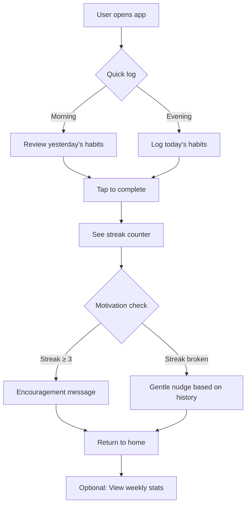

# SpecForge Double Diamond Workflow - Example Session

This document demonstrates a typical SpecForge session using the new Double Diamond workflow.

## Starting a New Session

```bash
$ specforge new "I want to build a habit tracking app for busy professionals"
```

## Stage 1: DISCOVERY 📋

**AI Response:**

---

# 📋 DISCOVERY: Understanding the Problem Space

Let me analyze the problem space for your habit tracking app.

## User Personas

### Persona 1: Sarah Chen

**Demographics**
- Age: 32
- Role: Product Manager at a tech startup

**Profile**
Sarah juggles multiple responsibilities at work and wants to build better personal habits like meditation, exercise, and reading. She has tried several habit apps but finds them too gamified or childish. She wants something minimal that integrates with her existing workflow.

**Pain Points**
- Most habit apps feel like games, not tools
- Too many notifications and reminders
- Don't integrate with calendar or productivity tools
- Takes too much time to log habits

**Goals**
- Build consistent daily habits without friction
- Track progress over weeks and months
- Share progress with accountability partner
- Minimal time investment (< 2 min/day)

**Key Scenarios**
- During morning coffee, quickly log yesterday's habits
- At end of week, review progress and adjust goals
- When motivation dips, see encouragement based on past success

### Persona 2: Marcus Rodriguez

**Demographics**
- Age: 28
- Role: Software Engineer

**Profile**
Marcus is data-driven and wants to optimize his personal habits. He tracks everything in spreadsheets and wants better visualization. He's technical and appreciates clean, functional design.

**Pain Points**
- Current apps don't provide enough data export
- Limited visualization options
- Can't customize tracking periods (wants 2-week cycles, not just weekly)
- No API for custom integrations

**Goals**
- Deep insights into habit patterns and correlations
- Customizable dashboards and reports
- Data portability and export options
- Flexible tracking schedules

**Key Scenarios**
- Sunday evening: review weekly habit data
- Start of month: export data for custom analysis
- When forming new habits: set different tracking parameters

## Competitor Analysis

### Competitor 1: Streaks

**Strengths**
- Beautiful, minimal UI
- Excellent for simple daily habits
- Strong privacy focus

**Weaknesses**
- Limited to daily tracking
- No data export
- Minimal analytics
- iOS only

**Our Differentiation**
We'll offer flexible tracking periods, robust data export, and cross-platform support.

### Competitor 2: Habitica

**Strengths**
- Gamification works for many users
- Social features and accountability
- Highly customizable

**Weaknesses**
- Too gamified for professionals
- Steep learning curve
- Distracting interface
- Feels like a game, not a productivity tool

**Our Differentiation**
We'll focus on professional aesthetic and minimalist design - no RPG elements.

### Competitor 3: Notion (DIY habit tracking)

**Strengths**
- Complete customization
- Integrates with other productivity tools
- Powerful database features

**Weaknesses**
- High setup friction
- Not optimized for habit tracking specifically
- Mobile app is slow for quick logging
- Requires template knowledge

**Our Differentiation**
We'll be opinionated and ready-to-use, but with enough power user features.

---

**Do these personas accurately represent your target users? Please confirm or let me know what to adjust.**

---

## User confirms with: `confirm`

**AI Response:**

✅ User personas confirmed!

## Stage 2: DEFINITION 🎯

Now let's define your MVP scope...

### Product Vision Statement

> "For busy professionals who want to build better habits without friction, HabitForge is a minimalist habit tracker that integrates with your existing workflow. Unlike gamified habit apps, we focus on data and simplicity."

### User Journey Map



### Feature Prioritization (MoSCoW)

| Feature | Priority | Effort | Description |
|---------|----------|--------|-------------|
| Quick habit logging | P0 | S | Tap to complete habit in < 2 seconds |
| Flexible tracking periods | P0 | M | Support daily, weekly, or custom cycles |
| Streak tracking | P0 | S | Visual counter for consecutive completions |
| Weekly summary view | P0 | M | Simple weekly progress chart |
| Data export (CSV) | P1 | S | Export all habit data |
| Habit categories/tags | P1 | M | Organize habits by area (health, work, learning) |
| Multiple reminders | P1 | L | Customizable reminder times per habit |
| Notes per habit entry | P2 | M | Add context to why habit was missed/completed |
| Dark mode | P2 | S | Toggle between light/dark themes |
| Apple Watch complications | P2 | L | Quick logging from watch face |
| Community/templates | P2 | XL | Browse and use habit tracking templates |

**MVP Scope**: P0 features only (5 features) - Quick logging, flexible periods, streaks, weekly summary, and basic data export.

---

**Does this represent the right scope for your MVP? Please confirm or adjust priorities.**

---

## User confirms with: `confirm`

✅ MVP scope confirmed!

## Stage 3: IDEATION 💡

Now let's explore technical options...

### Technical Options

#### Option 1: Native Mobile (Swift/Kotlin)

**Stack**
- Frontend: SwiftUI (iOS), Jetpack Compose (Android)
- Backend: None (local-only with iCloud/Local data sync)
- Database: SQLite via GRDB / SQLDelight
- Infrastructure: App Store / Play Store distribution

**Pros**
- Best performance and native feel
- Full platform feature access (widgets, watch complications)
- No backend costs
- Privacy-first (data stays on device)

**Cons**
- Need to maintain two codebases
- More complex sync across devices
- Harder to iterate quickly
- Limited data export options without backend

**Best For**
Apps that need deep platform integration and can afford native development resources.

#### Option 2: Cross-Platform Framework (Flutter/React Native)

**Stack**
- Frontend: Flutter or React Native
- Backend: Optional, could use Firebase for sync
- Database: SQLite via platform plugins or Firebase
- Infrastructure: App Store / Play Store

**Pros**
- Single codebase for iOS and Android
- Faster iteration cycles
- Larger developer pool
- Good performance with modern frameworks

**Cons**
- Some platform features require custom native code
- Slightly larger app size
- Framework dependency (vendor lock-in)
- Occasional framework bugs

**Best For**
Startups wanting to reach both platforms quickly with limited resources.

#### Option 3: Progressive Web App (Next.js + PWA)

**Stack**
- Frontend: Next.js with React
- Backend: Next.js API routes or separate backend
- Database: PostgreSQL via Prisma (hosted on Supabase/Railway)
- Infrastructure: Vercel / Netlify + PWA install prompts

**Pros**
- Single codebase for web, iOS, Android (via PWA)
- Fast iteration and deployment
- Easy data export (backend APIs)
- No app store review process

**Cons**
- Limited offline capabilities
- Push notifications not as reliable
- Some platform features unavailable
- Users may resist "installing" a website

**Best For**
MVP validation with users comfortable with web apps.

### Recommended Technical Approach

**Chosen Stack: Flutter + Firebase**

**Rationale**
- **Time to Market**: Single codebase gets us on both platforms quickly
- **Cost**: Firebase free tier handles backend needs (auth, sync, analytics)
- **Performance**: Flutter provides near-native performance
- **Data Export**: Firebase allows easy CSV/JSON exports
- **Scalability**: Can migrate to custom backend later if needed

**Tech Stack Details**
- **Frontend**: Flutter 3.x with Dart
- **State Management**: Riverpod (lightweight, scalable)
- **Local Storage**: Hive (fast NoSQL database for offline-first)
- **Backend**: Firebase (Firestore for sync, Auth for accounts)
- **Analytics**: Firebase Analytics
- **CI/CD**: GitHub Actions + Codemagic

**Technical Risks**

| Risk | Impact | Mitigation |
|------|--------|------------|
| Flutter platform-specific bugs | Medium | Allocate 20% buffer for native platform work |
| Firebase costs at scale | Low | Design data model to be efficient; can migrate later |
| App Store rejection for "minimal" app | Low | Focus on unique value prop (flexible periods, data export) |
| Offline sync complexity | Medium | Start with simple optimistic updates; improve iteratively |

---

**Does this technical approach work for your team and context? Please confirm or raise concerns.**

---

## User confirms with: `confirm`

✅ Technical approach confirmed!

## Stage 4: DELIVERY 🚀

Now let's create detailed specifications...

### Data Model

```typescript
// Core Entities

interface Habit {
  id: string
  name: string
  description?: string
  category: HabitCategory
  trackingPeriod: TrackingPeriod  // 'daily' | 'weekly' | 'custom'
  customPeriodDays?: number  // for custom periods
  color: string  // for UI
  icon: string  // emoji or icon name
  createdAt: DateTime
  archivedAt?: DateTime
}

interface HabitEntry {
  id: string
  habitId: string
  scheduledDate: DateTime
  completedAt?: DateTime
  missedAt?: DateTime
  skipped: boolean
  note?: string
  userId: string
}

interface User {
  id: string
  email: string
  displayName: string
  timezone: string
  reminderTime?: string  // HH:MM format
  preferences: UserPreferences
  createdAt: DateTime
}

interface UserPreferences {
  theme: 'light' | 'dark' | 'auto'
  weekStartsOn: 'monday' | 'sunday'
  showStreakCount: boolean
  celebrationLevel: 'minimal' | 'moderate' | 'enthusiastic'
}

enum HabitCategory {
  HEALTH = 'health',
  PRODUCTIVITY = 'productivity',
  LEARNING = 'learning',
  RELATIONSHIPS = 'relationships',
  FINANCE = 'finance',
  OTHER = 'other'
}

enum TrackingPeriod {
  DAILY = 'daily',
  WEEKLY = 'weekly',
  CUSTOM = 'custom'
}
```

### API Endpoints

#### `GET /habits`
**Description**: List all active habits for the current user

**Request**:
```typescript
interface GetHabitsQuery {
  includeArchived?: boolean
  category?: HabitCategory
}
```

**Response**: `200 OK`
```typescript
interface HabitsResponse {
  habits: Habit[]
  totalCount: number
}
```

#### `POST /habits`
**Description**: Create a new habit

**Request**:
```typescript
interface CreateHabitRequest {
  name: string
  description?: string
  category: HabitCategory
  trackingPeriod: TrackingPeriod
  customPeriodDays?: number
  color: string
  icon: string
}
```

**Response**: `201 Created`
```typescript
interface HabitResponse {
  habit: Habit
}
```

**Errors**:
- `400 Bad Request`: Invalid tracking period or custom period days
- `401 Unauthorized`: Missing or invalid auth token

#### `POST /habits/{habitId}/entries`
**Description**: Log or update a habit entry

**Request**:
```typescript
interface CreateEntryRequest {
  scheduledDate: string  // ISO 8601
  completed: boolean
  skipped?: boolean
  note?: string
}
```

**Response**: `201 Created`
```typescript
interface EntryResponse {
  entry: HabitEntry
  currentStreak: number
  longestStreak: number
}
```

#### `GET /habits/{habitId}/stats`
**Description**: Get statistics for a specific habit

**Request**:
```typescript
interface StatsQuery {
  period: 'week' | 'month' | 'year' | 'all'
  startDate?: string
  endDate?: string
}
```

**Response**: `200 OK`
```typescript
interface HabitStatsResponse {
  habitId: string
  period: StatsPeriod
  completionRate: number  // 0-1
  totalEntries: number
  completedEntries: number
  missedEntries: number
  currentStreak: number
  longestStreak: number
  bestDayOfWeek?: DayOfWeek
  entriesByDate: DateEntry[]
}
```

### Implementation Plan

#### Components

| Component | Responsibility |
|-----------|----------------|
| `HabitListScreen` | Display list of habits with quick-action buttons |
| `HabitDetailScreen` | Show habit stats, history, and settings |
| `QuickLogBottomSheet` | Overlay for quick habit completion |
| `StatsChartWidget` | Weekly completion rate visualization |
| `StreakCounter` | Animated counter showing current streak |
| `ReminderService` | Local notification scheduling |
| `SyncManager` | Handle offline/online data sync with Firestore |
| `ExportService` | Generate CSV/JSON exports |

#### Deployment Strategy

**Phase 1: Private Beta (2 weeks)**
- TestFlight (iOS) and Closed Testing (Android)
- Invite 20-50 beta users
- Focus on core flows (logging, viewing stats)
- Collect crash reports and feedback

**Phase 2: Public Launch (Week 3)**
- App Store and Play Store submission
- Product Hunt launch
- Focus on app store optimization (ASO)

**Phase 3: Iteration (Ongoing)**
- Weekly releases based on user feedback
- Add P1 features after MVP validation

#### Testing Strategy

**Unit Tests**
- Business logic for streak calculations
- Date handling for different tracking periods
- Data model validation

**Integration Tests**
- Firestore CRUD operations
- Sync conflict resolution
- Export functionality

**E2E Tests**
- Critical user flows (create habit, log entry, view stats)
- Cross-platform consistency

### Open Questions

1. Should we support habit templates or keep it simple initially?
2. Do we need social features (sharing progress) in MVP?
3. Should we offer a web dashboard in addition to mobile?

---

## Export

User types: `/export ./habit_forge_docs`

**Output:**
- `./habit_forge_docs/PRD.md` - Complete product requirements document
- `./habit_forge_docs/TECH_SPEC.md` - Detailed technical specification

Both documents include all validated personas, competitor analysis, product vision, MVP features, and technical decisions from the workflow.
